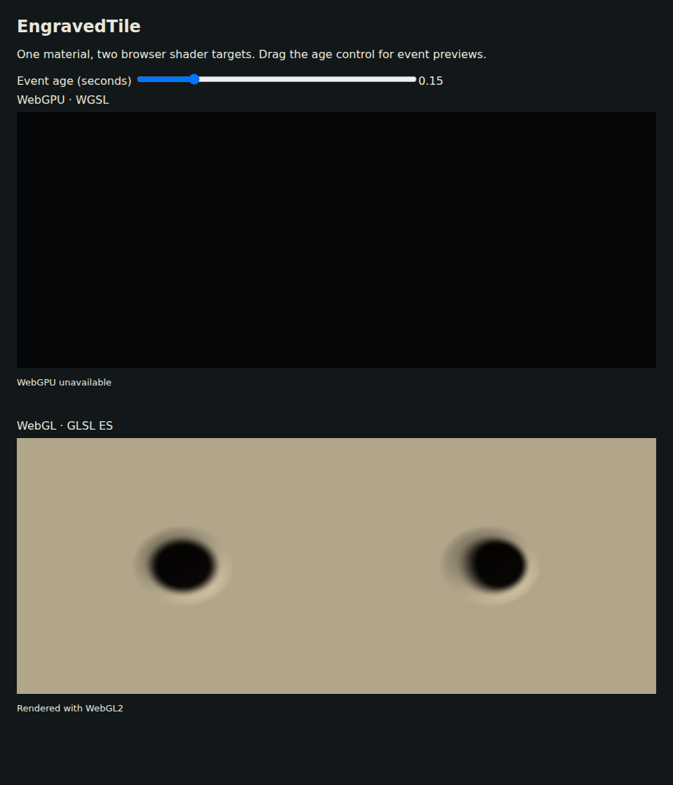
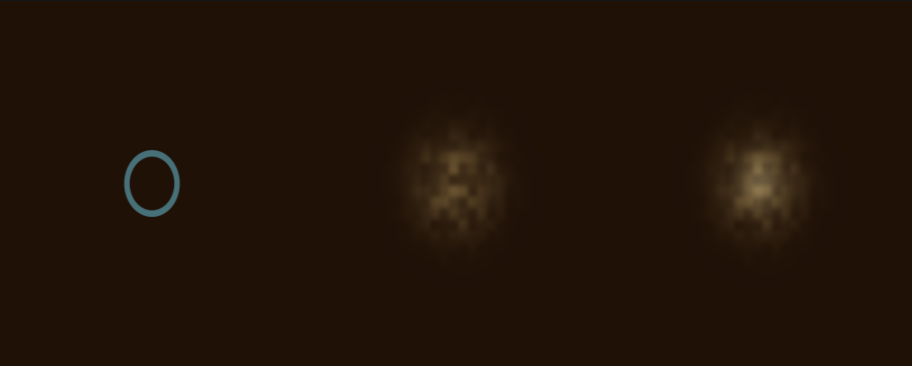

# Engraving, parallax and table events

Use `materiallib.Normals` for rounded engraved wells and normal conversion.
Use `materiallib.Effects` for uniform-driven ripple, dust and flash masks.
Effects automatically loads Procedural for its filtered dust noise; dependencies
are deduplicated when you also request Procedural explicitly.

| Normal helper | Arguments and result |
| --- | --- |
| `mlPipWellHeight` | `(vec2 p, float radius, depth)` → negative well height |
| `mlPipWellGradient` | Same inputs → analytic `vec2(dh/dx, dh/dy)` |
| `mlPipWellNormal` | Same inputs → unit tangent-space normal |
| `mlPipWellNormalAA` | Same inputs → normal whose depth fades when the well is unresolved |
| `mlTangentFromUV` | `(vec3 n, positionWorld, vec2 uv)` → derivative tangent, with a degenerate-UV fallback |
| `mlNormalToWorld` | `(vec3 tangentNormal, n, tangent, float handedness)` → unit world normal |
| `mlBumpNormal` | `(float height, vec3 n, positionWorld)` → derivative world normal |
| `mlParallaxUV` | `(vec2 uv, vec3 viewTangent, float height, scale, maxOffset)` → bounded displaced UV |
| `mlParallaxUVPhone` | `(vec2 uv)` → unchanged UV, without a height fetch |

Well p is relative to the pip center in tangent-plane units. Radius and depth
use those units. The height is `-depth * max(1 - |p|²/radius², 0)²`, so its slope
is zero at the center and rim. Nonpositive radius disables the well; negative
depth is clamped to zero. Pip arrangement and face layout belong to the consumer.
For many wells, combine heights at the material call site and call `mlBumpNormal`
once, or select the nearest center before evaluating an analytic normal.

Normal conversion expects a unit normal and orthonormal tangent. Handedness is
negative for a mirrored tangent frame, positive otherwise. The UV-derived tangent
accounts for mirrored UVs when deriving the tangent direction; pass the frame's
handedness when forming the bitangent. `mlBumpNormal` uses world-position and
height derivatives and handles reversed screen-space orientation. The AA, tangent
and bump helpers are fragment-only and must execute in uniform control flow.

Parallax is a single-height UV offset, not parallax occlusion or self-shadowing.
Positive height denotes depth into the surface. The view vector points toward
the viewer in tangent space. Its z denominator is floored at 0.15, and offset
magnitude never exceeds `maxOffset` (in UV units). Correct the tangent/UV scale
for the mesh's physical proportions. The phone program should call
`mlParallaxUVPhone` and omit the height read; selecting between expensive and
cheap colors after evaluating both does not save sampling work.

```selena
let wellHeight = mlPipWellHeight(localPipPosition, pipRadius, pipDepth)
let normal = mlBumpNormal(wellHeight, normalize(geo.worldNormal), geo.worldPos)
```

| Event helper | Arguments |
| --- | --- |
| `mlEventEnvelope` | `float age, duration, intensity` |
| `mlRadialRippleWidth` | `vec2 p, center, float age, intensity, duration, speed, halfWidth, pixelWidth` |
| `mlRadialRippleAA` | Same, omitting pixelWidth |
| `mlDustWidth` | `vec2 p, center, float age, intensity, duration, speed, spread, frequency, pixelWidth` |
| `mlDustAA` | Same, omitting pixelWidth |
| `mlImpactFlashWidth` | `vec2 p, center, float age, intensity, duration, radius, pixelWidth` |
| `mlImpactFlashAA` | Same, omitting pixelWidth |

All event helpers return a scalar mask. Age and duration are seconds; speed is
plane units per second. Positions, radii, widths and the explicit pixel footprint
share plane units. Intensity is clamped to [0, 1]. Negative age, expired age and
nonpositive duration return exactly zero. The envelope is `(1 - age/duration)²`
within the lifetime. Ripple suppresses subpixel thin rings. Dust filters both
its value-noise clumps and its radial Gaussian. Flash broadens its Gaussian and
attenuates the peak when unresolved, preserving its approximate integrated energy.

Supply position, age and intensity through ordinary material params. The library
adds no implicit clock, scene state or binding. The host should stop drawing an
expired overlay. Use a straight-alpha output such as `vec4f(effectColor, mask)`
and the host's alpha blend mode for a transparent overlay. The preview mixes
masks onto a substrate so it can show them without a scene blending setup.

```sh
GOWORK=off go run ./examples/material-library/preview -modules normals,brdf \
  -source examples/material-library/normals.sel -out normals-preview.html
GOWORK=off go run ./examples/material-library/preview -modules effects \
  -source examples/material-library/effects.sel -out effects-preview.html
GOWORK=off go test ./...
```

Tests cover analytic well gradients, unit normals, bounded grazing offsets, the
phone fallback's lack of textures/derivatives, event time boundaries, negative
intensity and translated centers. Every helper and example emits all four
targets and passes Naga/glslang validation where applicable. Native MSL
compilation and browser WebGPU execution remain unverified locally.




Captures use this change's examples at a 960 × 1120 viewport. The event canvas
uses WebGL1 after the hash precision fix; the recording uses updated WebGL2. The
[phone-width capture](effects-mobile.png) uses a 390 × 844 viewport with a
342-pixel-wide render target. The [age-control recording](effects.webm) drives
the running shader from negative age through expiry. At age 0.73 seconds, all
three panels return the same substrate pixel, RGBA (31, 17, 6, 255), verified
by WebGL readback. [Expired-state capture](effects-expired.png).

The normal example emits 4,078/3,903/4,164/3,879 bytes for WGSL/GLSL/Metal/GLES,
with 87 optimized fragment SPIR-V function instructions. The event example emits
12,718/12,842/13,087/12,818 bytes, with 429 instructions after the mediump hash
fix. Dust uses Procedural's bounded lattice hash; the effect envelope, API and
host descriptor are unchanged. See the
[measurement method](README.md). Actual phone GPU timings require the host scene
and physical device.
