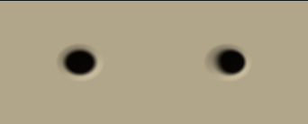

# Engraving, parallax and table events

Use `materiallib.Normals` for rounded engraved wells and normal conversion.
Use `materiallib.Effects` for uniform-driven ripple, dust and flash masks.
Effects automatically loads Procedural for its filtered dust noise; dependencies
are deduplicated when you also request Procedural explicitly.

| Normal helper | Arguments and result |
| --- | --- |
| `mlMaxAbs3` | `(vec3 v)` → largest absolute component |
| `mlSafeNormalize` | `(vec3 v, fallback)` → unit vector, using the normalized fallback when v is zero |
| `mlPipWellHeight` | `(vec2 p, float radius, depth)` → negative well height |
| `mlPipWellGradient` | Same inputs → analytic `vec2(dh/dx, dh/dy)` |
| `mlPipWellNormal` | Same inputs → unit tangent-space normal |
| `mlPipWellNormalAA` | Same inputs → normal whose depth fades when the well is unresolved |
| `mlTangentFromUV` | `(vec3 n, positionWorld, vec2 uv)` → derivative tangent, with a degenerate-UV fallback |
| `mlNormalToWorld` | `(vec3 tangentNormal, n, tangent, float handedness)` → unit world normal |
| `mlBumpNormal` | `(float height, vec3 n, positionWorld)` → derivative world normal |
| `mlParallaxUV` | `(vec2 uv, vec3 viewTangent, float height, scale, maxOffset)` → bounded displaced UV |
| `mlParallaxUVPhone` | `(vec2 uv)` → unchanged UV, without a height fetch |

Well p is relative to the pip center in tangent-plane units. Radius and depth
use those units. The height is `-depth * max(1 - |p|²/radius², 0)²`, so its slope
is zero at the center and rim. Nonpositive radius disables the well; negative
depth is clamped to zero. Pip arrangement and face layout belong to the consumer.
Coordinates are divided by radius before squaring. The gradient caps the
depth/radius ratio at 1,024 to keep extreme slopes representable on mediump
targets; ordinary well proportions retain the analytic gradient.
For many wells, combine heights at the material call site and call `mlBumpNormal`
once, or select the nearest center before evaluating an analytic normal.

Normal conversion normalizes the geometric normal and orthogonalizes the
tangent. A zero tangent-space normal falls back to the geometric normal;
degenerate tangents use a perpendicular axis. `mlSafeNormalize` scales by the
largest component before squaring and uses +Z when its fallback is also zero.
It does not recover precision already lost in the input or sanitize NaN/Inf
inputs. Keep positions rebased and inputs within the target's finite range.
Handedness is
negative for a mirrored tangent frame, positive otherwise. The UV-derived tangent
accounts for mirrored UVs when deriving the tangent direction; pass the frame's
handedness when forming the bitangent. `mlBumpNormal` uses world-position and
height derivatives and handles reversed screen-space orientation. The AA, tangent
and bump helpers are fragment-only and must execute in uniform control flow.
Tangent and bump calculations rescale derivatives before multiplying them.
Degeneracy uses relative derivative lengths, with a dimensionless 1/256 angular
threshold; tangent projection uses a 1/1,024 squared-length ratio. These tests
are independent of mesh size and screen resolution while the input derivatives
remain representable. Bump normals avoid division by the screen-space area and
fall back to the geometric normal when derivatives collapse.

Parallax is a single-height UV offset, not parallax occlusion or self-shadowing.
Positive height denotes depth into the surface. The view vector points toward
the viewer in tangent space. Its z denominator is floored at 0.15, and offset
magnitude never exceeds `maxOffset` (in UV units). Correct the tangent/UV scale
for the mesh's physical proportions. The phone program should call
`mlParallaxUVPhone` and omit the height read; selecting between expensive and
cheap colors after evaluating both does not save sampling work.

```selena
let wellHeight = mlPipWellHeight(localPipPosition, pipRadius, pipDepth)
let normal = mlBumpNormal(wellHeight, geo.worldNormal, geo.worldPos)
```

| Event helper | Arguments |
| --- | --- |
| `mlSafeLength2` | `vec2 v` → length computed after component scaling |
| `mlEventGaussian` | `vec2 q, float radius, pixelWidth, falloff` → filtered radial mask; falloff is clamped to [0, 4] |
| `mlEventEnvelope` | `float age, duration, intensity` |
| `mlRadialRippleWidth` | `vec2 p, center, float age, intensity, duration, speed, halfWidth, pixelWidth` |
| `mlRadialRippleAA` | Same, omitting pixelWidth |
| `mlDustWidth` | `vec2 p, center, float age, intensity, duration, speed, spread, frequency, pixelWidth` |
| `mlDustAA` | Same, omitting pixelWidth |
| `mlImpactFlashWidth` | `vec2 p, center, float age, intensity, duration, radius, pixelWidth` |
| `mlImpactFlashAA` | Same, omitting pixelWidth |

All event helpers return a scalar mask. Age and duration are seconds; speed is
plane units per second. Positions, radii, widths and the explicit pixel footprint
share plane units. Intensity is clamped to [0, 1]. Negative age, expired age and
nonpositive duration return exactly zero. The envelope is `(1 - age/duration)²`
within the lifetime. Ripple suppresses subpixel thin rings. Dust filters both
its value-noise clumps and its radial Gaussian. Flash broadens its Gaussian and
attenuates the peak when unresolved, preserving its approximate integrated energy.
Nonpositive flash radii and zero dust spread at age zero produce zero masks.
Every disabled path chooses a positive denominator before division; multiplying
an invalid result by zero is insufficient. Gaussian distances and AA footprint
lengths are scaled before squaring. The Gaussian variance floor of 1/1,024 in
scaled units only clips negligible tails. Ripple clamps its distance before
smoothstep and uses a representable minimum AA width of 2^-14 plane units.
Durations or radii that flush to zero on a low-precision target are disabled.

Supply position, age and intensity through ordinary material params. The library
adds no implicit clock, scene state or binding. The host should stop drawing an
expired overlay. Use a straight-alpha output such as `vec4f(effectColor, mask)`
and the host's alpha blend mode for a transparent overlay. The preview mixes
masks onto a substrate so it can show them without a scene blending setup.

```sh
GOWORK=off go run ./examples/material-library/preview -modules normals,brdf \
  -source examples/material-library/normals.sel -out normals-preview.html
GOWORK=off go run ./examples/material-library/preview -modules effects \
  -source examples/material-library/effects.sel -out effects-preview.html
GOWORK=off go test ./...
```

Tests cover analytic well gradients, unit normals, bounded grazing offsets, the
phone fallback's lack of textures/derivatives, event time boundaries, negative
intensity and translated centers. Every helper and example emits all four
targets and passes Naga/glslang validation where applicable. Native MSL
compilation and browser WebGPU execution remain unverified locally.
The emitted-expression tests cover rotated/mirrored tangents from 128 to 8,192
pixels, constant-height and sloped bump surfaces, degenerate frames, zero wells,
zero parallax offsets and event lifetime/radius boundaries. Float64, float32,
nearest-rounded mediump and truncated mediump models scan all expressions and
rounded builtin intermediates for NaN/Inf. Mediump models flush subnormals;
software browser captures alone do not prove physical phone GPU behavior.





Captures were refreshed from the guarded shaders at a 960 × 1120 viewport.
The event canvas uses WebGL1; the recording uses WebGL2. Both
[normal](normals-mobile.png) and [event phone-width captures](effects-mobile.png)
use a 390 × 844 viewport with a
342-pixel-wide render target. The [age-control recording](effects.webm) drives
the running shader from negative age through expiry. At age 0.73 seconds, all
three panels return the same substrate pixel, RGBA (31, 17, 6, 255), verified
by WebGL readback. [Expired-state capture](effects-expired.png).

The normal example emits 6,018/5,783/6,096/5,759 bytes for WGSL/GLSL/Metal/GLES,
with 144 optimized fragment SPIR-V function instructions. The event example emits
15,476/15,632/15,901/15,608 bytes, with 522 instructions. Compared with the
unguarded helpers, that adds 1,940 WGSL bytes / 57 instructions for normals and
2,758 bytes / 93 instructions for events. Dust uses Procedural's bounded lattice
hash. Existing signatures and the host descriptor remain unchanged. See the
[measurement method](README.md). Actual phone GPU timings require the host scene
and physical device.
