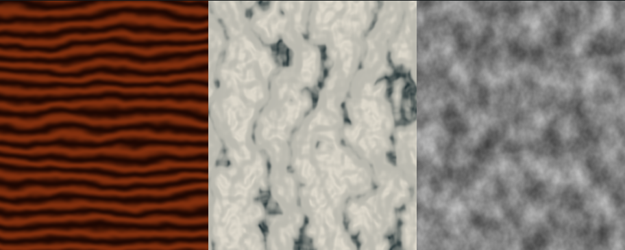

# Procedural materials

Link `materiallib.Procedural` to share texture-free wood and marble patterns,
noise and pixel-footprint filtering across all four shader targets.

```selena
let grain = mlWoodGrainAA(geo.uv * vec2f(3.0, 5.0), 28.0, 8.0)
let vein = mlMarbleVeinAA(geo.uv * 4.0, 9.0, 12.0)
```

| Helpers | Contract |
| --- | --- |
| `mlHash11(float)`, `mlHash21(vec2)`, `mlHash22(vec2)` | Float hashes in [0, 1); non-cryptographic |
| `mlNoiseGradient2(vec2)` | Unit lattice gradient |
| `mlNoiseFade2(vec2)` | Quintic interpolation weights |
| `mlValueNoise2(vec2)` | Value noise in [0, 1] |
| `mlGradientNoise2(vec2)`, `mlSimplexNoise2(vec2)` | Signed 2D noise, approximately [-1, 1] |
| `mlValueNoise2Deriv`, `mlGradientNoise2Deriv`, `mlSimplexNoise2Deriv` | `vec3(value, d/dx, d/dy)`, one `vec2` coordinate argument |
| `mlSimplexCorner2(vec2, vec2)` | Simplex kernel contribution with gradient |
| `mlNoiseFilter(float footprint)` | Octave attenuation; 1 below 0.25, 0 above 0.75 |
| `mlValueNoise2Filtered`, `mlGradientNoise2Filtered`, `mlSimplexNoise2Filtered` | `(vec2 p, float footprint)`; fade toward the noise's mean |
| `mlFBm4`, `mlFBm4AA` | Four octaves at 1×/2×/4×/8×, amplitudes 0.5/0.25/0.125/0.0625, normalized by 15/16 |
| `mlFBm4Filtered`, `mlFBm4DerivFiltered` | `(vec2 p, float footprint)`; scalar value or value plus analytic gradient |
| `mlFilteredSinWidth` | `(float phase, float footprint)`; Gaussian attenuation of a sinusoid |
| `mlFilteredSin` | `(float phase)`; fragment `fwidth` wrapper |
| `mlWoodGrainFiltered`, `mlMarbleVeinFiltered` | `(vec2 p, float frequency, float warp, float footprint)`; scalar [0, 1] motif |
| `mlWoodGrainAA`, `mlMarbleVeinAA` | `(vec2 p, float frequency, float warp)`; fragment `fwidth` wrapper |

The `AA` wrappers measure `length(fwidth(p))` after coordinate scaling. Call
them in uniform fragment control flow. The compiler records the existing
`OES_standard_derivatives` host requirement for WebGL1. GLSL ES 3, WGSL and Metal
have derivatives in core. Explicit-footprint helpers can also run without
screen derivatives, including a vertex stage. Supply a conservative pixel width
in the helper's coordinate units; do not pass the unscaled UV footprint.

Filtered fBm fades unresolved octaves to zero without renormalizing the visible
octaves. Value noise fades to 0.5. Wood estimates its warped phase gradient
analytically and fades unresolved rings to 0.5. Marble fades the narrow vein
motif to its analytic mean, 0.196380615234375. This avoids turning minified marble
into a uniformly vein-free surface. These are conservative attenuation helpers,
not exact integration of a warped pixel footprint. Warps with discontinuities or
poorly estimated explicit footprints can still alias.

Hashes use bounded float arithmetic without textures, integer bit operations or
a fragment `highp` requirement. Coordinates are reduced modulo 256, split into
base-16 digits and scrambled with three additive Feistel rounds. After coordinate
reduction, lattice mixing products stay below 256 and the output has 256 evenly spaced
levels in [0, 1). `mlHash22` uses an integer coordinate offset for its second
channel. Fractional inputs also remain in range, but these are lattice-oriented,
non-cryptographic hashes, not independent random samples for arbitrarily close
coordinates. The visual pattern changes from the earlier hash implementation.

The hashes repeat every 256 input coordinate units. Value and gradient noise
therefore repeat every 256 cells along each axis; simplex gradients repeat along
the triangular lattice basis. Keep the intended patch smaller than that period,
or use host-selected domain offsets for distinct patches. Hash reduction cannot
recover fractional coordinates already lost at the input. On WebGL1, keep noise
domains near the origin (prefer |p| <= 32 before the four-octave fBm expansion),
and rebase world coordinates in the host before passing them to the shader.
Large phase/frequency products can likewise exceed mediump precision. The
[GLSL ES 1.00 precision contract](https://registry.khronos.org/OpenGL/specs/es/2.0/GLSL_ES_Specification_1.00.pdf)
requires mediump fragments and makes fragment highp optional. Noise still need
not be bit-identical across GPU implementations because interpolation and
trigonometric builtins can round differently.

Statistical tests read each target's emitted local expressions and output, then
evaluate them with float32 and two binary16 models: nearest rounding and
truncation, both flushing subnormals. They check positive/negative lattice grids,
wrap boundaries, histogram bins, mean/variance, distinct values, adjacent-cell
and vector-channel correlation, and nonzero noise/fBm variance. Every hash
channel has mean 0.498047 and variance 0.083332 on the 1,024-cell sample, with
four zeros and 64 samples in each of 16 bins in all three precision models.
The old hash produces 878 zeros in the nearest-rounding regression model. These
are numerical models of emitted shaders; native execution remains a separate
check. The quintic value/gradient noise and compact simplex kernel have analytic
first derivatives, compared with finite differences at negative coordinates and
lattice boundaries.

The example's wood, marble and fBm are all evaluated in one gallery shader.
Its source sizes are 104,448 bytes WGSL, 105,900 GLSL, 107,350 Metal and 105,876 GLES.
The optimized fragment SPIR-V has 4,239 function instructions, counted with the
same Naga/spirv-opt method described in [BRDF helpers](brdf.md). This is a compiler
proxy, not a GPU hardware instruction count. The precision fix adds 56,240 WGSL
bytes and 2,496 optimized instructions to the earlier three-pattern gallery.
Production materials that call only one pattern emit only that pattern's
dependency chain. Standalone wood and marble AA probes emit about 34–36 KB
across targets; a regression test bounds each pattern to 64 KiB. Prefer explicit
footprints and a single noise layer for phone
materials when four octaves exceed the host's measured budget. Unused modules
still add no shader bytes or host bindings.

```sh
GOWORK=off go run ./examples/material-library/preview -modules procedural \
  -source examples/material-library/procedural.sel -out material-preview.html
GOWORK=off go test ./materiallib
```

Every helper and the example pass emission on WGSL/GLSL/Metal/GLES, Naga WGSL
validation, and glslang validation of both GL dialects. Metal native compilation
requires an Apple toolchain. Replace local `softBand` helpers with
`mlFilteredSin`; use wood/marble helpers when domain warping adds useful detail.
Keep low-cost material tiers selected by the host.



Captures use this example after the precision fix: a 900 × 360 canvas in
software WebGL1, the [same canvas in WebGL2](procedural.png), and a
[342 × 137 WebGL1 canvas](procedural-webgl1-mobile.png) in a 390 × 844 viewport.
WebGL1 uses the emitted `precision mediump float` shader; no fragment highp
upgrade is applied. Desktop drivers may still evaluate mediump at float32,
which is why reduced-precision simulation is required too. WebGPU browser
rendering remains unverified because device creation fails in the local graphics
driver; Naga validates the WGSL.

For the simplex kernel and analytic derivative principle, see the primary
[simplex noise paper](https://jcgt.org/published/0011/01/02/paper-lowres.pdf).
This implementation uses a triangular lattice; it does not implement
that paper's periodic or rotating-gradient API.
