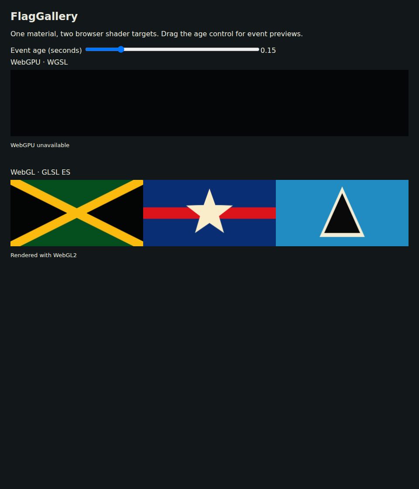

# Signed-distance graphics

Link `materiallib.Shapes` for fragment graphics that stay crisp without flag
textures or a mesh for each symbol. Distances are negative inside and positive
outside; positions, radii, extents and widths use the same coordinate units.
Convert a distance to coverage once, after combining shapes.

```selena
let p = (geo.uv - vec2f(0.5, 0.5)) * vec2f(flyToHoist, 1.0)
let stripe = mlSDSaltire(p, vec2f(flyToHoist * 0.5, 0.5), 0.065)
let star = mlSDStar(p, 0.37, 0.15, 5.0, 1.57079632679)
let coverage = mlSDFMask(mlSDUnion(stripe, star))
return mix(backgroundColor, symbolColor, coverage)
```

Preserve the flag's fly-to-hoist ratio in the mesh and multiply centered UV x by
that ratio before evaluating shapes. `mlSDFMask` uses `fwidth(distance)` to cover
approximately one pixel across the boundary; call it in uniform fragment control
flow. `mlSDFMaskWidth(distance, pixelWidth)` accepts an explicit distance-field
footprint when derivatives are unavailable. The WebGL1 derivative extension is
recorded in the existing host descriptor.

| Function | Arguments |
| --- | --- |
| `mlSDCircle` | `vec2 p, float radius` |
| `mlSDRect` | `vec2 p, halfExtent` |
| `mlSDRoundedRect` | `vec2 p, halfExtent, float radius` |
| `mlSDSegment` | `vec2 p, a, b`; unsigned distance to a finite segment |
| `mlSDTriangle` | `vec2 p, a, b, c`; either winding |
| `mlSDRegularPolygon` | `vec2 p, float radius, sides, rotation`; radius is apothem, rotation points a face normal |
| `mlSDStar` | `vec2 p, float outerRadius, innerRadius, points, rotation`; rotation points an outer tip |
| `mlSDStripe` | `vec2 p, normal, float offset, halfWidth`; nonzero normal is normalized internally |
| `mlSDSaltire` | `vec2 p, halfExtent, float halfWidth`; diagonal cross clipped to the rectangle |
| `mlPolygonEdge` | `vec2 p, a, b`; returns edge distance and parity multiplier |
| `mlSDPolygonFinish` | `float minimumEdgeDistance, parityProduct` |
| `mlSDUnion`, `mlSDIntersection`, `mlSDSubtract` | `float a, b` |
| `mlSDOutline` | `float distance, halfWidth` |
| `mlSDSmoothUnion` | `float a, b, radius` |
| `mlSDFMask`, `mlSDFMaskWidth` | Signed distance; optional explicit full pixel width |

Angles are radians. Polygon sides and star points are rounded down and clamped
to 3–64. Stars fold their angles with floor modulo, so negative-angle sectors
match on every target. Degenerate triangles and segments return unsigned edge
distance; a zero-radius star returns distance to the origin. Smooth union and
min/max booleans preserve a signed field, but intersections need not be exact
Euclidean distance near corners. Use `fwidth` on the combined field.

For arbitrary polygons, including concave emblems, start with a large positive
distance and parity 1. For each closed edge, update the minimum distance with
`edge.x` and multiply parity by `edge.y`. Pass those values to
`mlSDPolygonFinish`, then convert to coverage. Horizontal and repeated edges are
safe. Multiple contours follow the even-odd rule, which can represent holes.

```selena
var nearest = 1000000.0
var parity = 1.0
for (var i = 0i; i < 4i; i = i + 1i) {
    let next = i < 3i ? i + 1i : 0i
    let edge = mlPolygonEdge(p, vertices[i].xy, vertices[next].xy)
    nearest = min(nearest, edge.x)
    parity = parity * edge.y
}
let coverage = mlSDFMask(mlSDPolygonFinish(nearest, parity))
```

Declare `vertices` as `param vertices : array<vec4, 4>` and use `.xy` for the
coordinates. The padding keeps the existing 16-byte std140 array stride valid
in WGSL; small-element uniform arrays are not currently padded by that emitter.
Pack these vertices through the existing descriptor. Limit edge counts on phone shaders; procedural graphics
save textures, but each evaluated edge still costs arithmetic.

The compiler now recognizes `true`/`false` and boolean `==`/`!=`. Boolean ordering,
boolean arithmetic and mixed boolean/numeric equality are rejected. Metal
`mod(x, y)` now emits `x - y * floor(x / y)` for scalar and vector arguments,
matching WGSL/GLSL/GLES for negative inputs. Use a nonzero divisor. This fixes a
cross-target behavior difference without changing syntax or the descriptor.

```sh
GOWORK=off go run ./examples/material-library/preview -modules shapes \
  -source examples/material-library/shapes.sel -out material-preview.html
GOWORK=off go test ./...
```

The example preserves a 2:1 panel ratio and shows a saltire, star and layered
triangle. Its source sizes are 10,774 bytes WGSL, 10,575 GLSL, 11,034 Metal and
10,551 GLES. The optimized fragment SPIR-V has 257 function instructions, counted
with the [BRDF measurement method](brdf.md). Unused shape helpers add no code.
Every helper, example and boolean/modulo conformance fixture passes Naga or
glslang validation where applicable; Metal emission is covered without native
MSL compilation.



Capture: the example in this change, 960 × 1120 viewport, software WebGL2.
The [phone-width capture](shapes-mobile.png) uses a 390 × 844 viewport and a
342-pixel-wide render target to exercise coverage at a lower raster resolution.
The local driver cannot create a WebGPU device; Naga validates the WGSL.
Replace expanded polygon parity expressions and custom star folding with these
helpers. Keep heraldry palettes, official proportions and fine emblem choices
in the consuming application.
